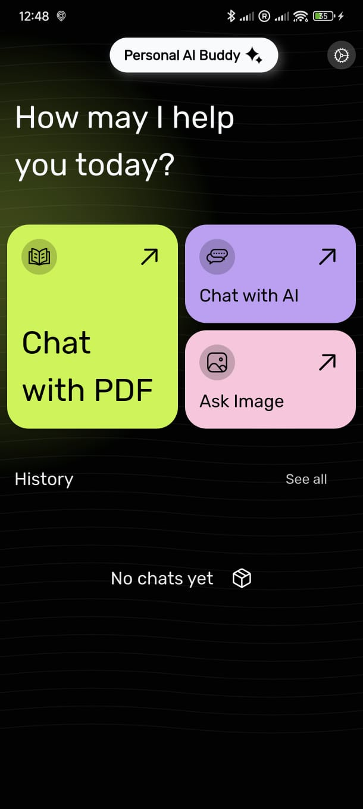

# 🤖 AI Chatbot

A cross-platform AI chatbot application built with Flutter. This project serves as a foundational template for developing intelligent conversational agents that can run seamlessly on Android, iOS, Web, and Desktop platforms.

## 📱 Screenshots

<div align="center">
  
  
  
</div>

## 🧠 Features

- **Cross-Platform Support**: Runs on Android, iOS, Web, Windows, macOS, and Linux.
- **AI-Powered Conversations**: Integrates with AI models to provide intelligent responses.
- **User-Friendly Interface**: Clean and intuitive UI for seamless user experience.
- **Extensible Architecture**: Modular codebase for easy feature enhancements.

## 🚀 Getting Started

### Prerequisites

Ensure you have the following installed:

- [Flutter SDK](https://flutter.dev/docs/get-started/install)
- [Dart SDK](https://dart.dev/get-dart)
- An IDE like [Android Studio](https://developer.android.com/studio) or [Visual Studio Code](https://code.visualstudio.com/)

### Installation

1. **Clone the repository:**

   ```bash
   git clone https://github.com/aarogyaojha/ai_chatbot.git
   cd ai_chatbot
   ```

2. **Fetch dependencies:**

   ```bash
   flutter pub get
   ```

3. **Run the application:**

   - **Android/iOS:**

     ```bash
     flutter run
     ```

   - **Web:**

     ```bash
     flutter run -d chrome
     ```

   - **Desktop (Windows/macOS/Linux):**

     ```bash
     flutter run -d windows  # Replace with your OS
     ```

## 🛠️ Project Structure

```
ai_chatbot/
├── android/        # Android-specific files
├── ios/            # iOS-specific files
├── lib/            # Main Dart codebase
├── web/            # Web-specific files
├── macos/          # macOS-specific files
├── windows/        # Windows-specific files
├── linux/          # Linux-specific files
├── assets/         # Assets like images and icons
├── test/           # Unit and widget tests
├── pubspec.yaml    # Project metadata and dependencies
└── README.md       # Project documentation
```

## 📦 Dependencies

Key packages used in this project:

- `flutter`: The core Flutter SDK.
- `cupertino_icons`: Icons for iOS style.
- _Add other dependencies here as needed._

Refer to `pubspec.yaml` for the complete list.

## 🤝 Contributing

Contributions are welcome! To contribute:

1. Fork the repository.

2. Create a new branch:

   ```bash
   git checkout -b feature/your-feature-name
   ```

3. Make your changes and commit them:

   ```bash
   git commit -m "Add your message here"
   ```

4. Push to your forked repository:

   ```bash
   git push origin feature/your-feature-name
   ```

5. Open a pull request detailing your changes.

Please ensure your code adheres to the project's coding standards and passes all tests.

## 📄 License

This project is licensed under the [MIT License](LICENSE).

## 🙋‍♂️ Acknowledgements

- [Flutter](https://flutter.dev/)
- [Dart](https://dart.dev/)
